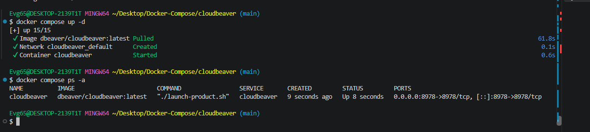
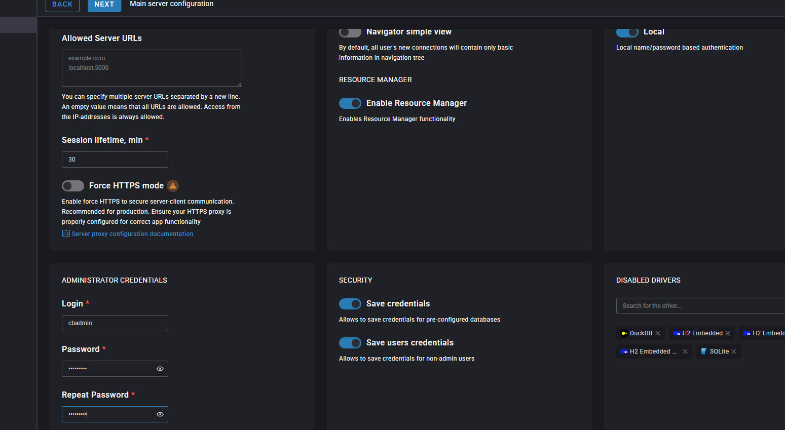

# 🐳 Лабораторная работа: Развертывание CloudBeaver через Docker Compose

**CloudBeaver** — это веб-версия популярного desktop-инструмента DBeaver. Она позволяет полноценно работать с базами данных (PostgreSQL, MySQL, SQLite и др.) прямо из окна браузера: настраивать подключения к серверам, выполнять SQL-запросы, просматривать структуру таблиц и экспортировать данные.

**Локальный порт веб-интерфейса:** `8978`

---

## 🏗️ 1. Описание проекта и конфигурация

Для выполнения работы подготовлен файл конфигурации `compose.yaml` (структура проекта: `cloudbeaver/compose.yaml`). 

Конфигурация описывает один сервис **`cloudbeaver`** на базе официального образа `dbeaver/cloudbeaver`. Чтобы все созданные подключения, пользовательские настройки и сессии сохранялись при перезапуске контейнера, настроено монтирование данных в локальную директорию `./workspace`.

### 📂 Структура проекта

```text
cloudbeaver/
├── compose.yaml  # Конфигурационный файл Docker Compose
├── README.md     # Описание проекта и лабораторной работы
├── workspace/    # Локальная директория для сохранения настроек и подключений
├── 1.png         # Скриншоты для отчета
├── 2.png
└── 3.png
```

---

## 🚀 2. Запуск контейнера в Docker

Инициализация окружения и запуск контейнера выполнены в фоновом режиме с помощью команды:

```bash
docker compose up -d
```

### Скриншот 1: Успешный запуск контейнера в терминале

---

## 🖥️ 3. Первичная настройка

При первом открытии интерфейса CloudBeaver по адресу [http://localhost:8978](http://localhost:8978) запускается мастер первоначальной конфигурации, где необходимо создать учетную запись главного администратора.

### Требования к учетной записи:

| Параметр | Значение / Требование |
| :--- | :--- |
| **Логин** | `cbadmin` |
| **Пароль** | Не менее 8 символов, минимум одна заглавная и одна строчная буква |

### Скриншот 2: Создание администратора CloudBeaver


---

## 🗄️ 4. Веб-интерфейс CloudBeaver

После успешной авторизации открывается основное рабочее пространство приложения с левым деревом навигации по базам данных и интерактивным SQL-редактором. Интерфейс готов к подключению и администрированию целевых СУБД (PostgreSQL, MySQL, SQLite и др.).
