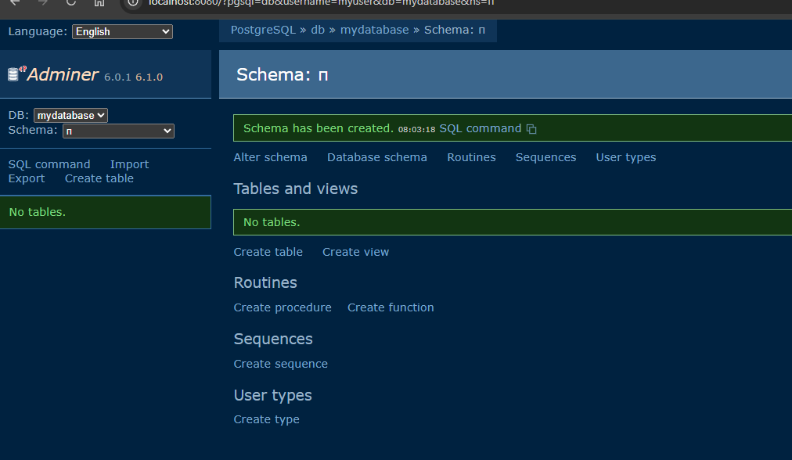

# 🐳 Лабораторная работа: PostgreSQL + Adminer через Dockerfile

**Adminer** — универсальный веб-клиент для управления базами данных (PostgreSQL, MySQL, SQLite, Oracle и др.), написанный на PHP. В данном проекте Adminer **собран из собственного Dockerfile** на базе официального образа с добавлением драйвера PostgreSQL.

---

### 🌐 Сетевые параметры
* **Локальный порт Adminer:** `8080`
* **Внутренний порт PostgreSQL:** `5432`

---

## 🏗️ 1. Описание проекта и конфигурация

Проект состоит из двух связанных сервисов:
* 🗄️ **db** — СУБД PostgreSQL 17-alpine
* 🐳 **adminer** — веб-интерфейс, собранный из кастомного `Dockerfile`

### 📄 Dockerfile
```dockerfile
FROM adminer:latest
USER root
RUN apk add --no-cache php83-pgsql || true
USER adminer
EXPOSE 8080
HEALTHCHECK --interval=30s --timeout=10s --retries=3 \
  CMD wget --spider -q http://localhost:8080 || exit 1
```

### 📂 Структура проекта
```text
postgresql-adminer/
├── README.md
├── Dockerfile
├── compose.yaml
├── 1.png
├── 2.png
└── 3.png
```

---

## 🚀 2. Сборка и запуск

Выполните команду в терминале для сборки образов и запуска контейнеров в фоновом режиме:

```bash
docker compose up -d --build
```

### 📸 Скриншот 1: Успешная сборка и запуск

---

## 🖥️ 3. Вход в Adminer

Откройте браузер и перейдите по адресу: [http://localhost:8080](http://localhost:8080)

### 🔑 Параметры подключения:

| Параметр | Значение |
| :--- | :--- |
| **System** | `PostgreSQL` |
| **Server** | `db` |
| **Username** | `myuser` |
| **Password** | `mypassword` |
| **Database** | `mydatabase` |

### 📸 Скриншот 2: Экран входа Adminer

---

## 🗄️ 4. Работа с БД в Adminer

После успешной авторизации вам откроется панель управления со списком таблиц, возможностью выполнять произвольные SQL-запросы, а также инструментами для экспорта и импорта данных.

### 📸 Скриншот 3: База данных в Adminer

